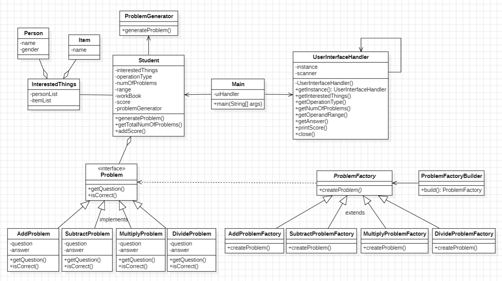
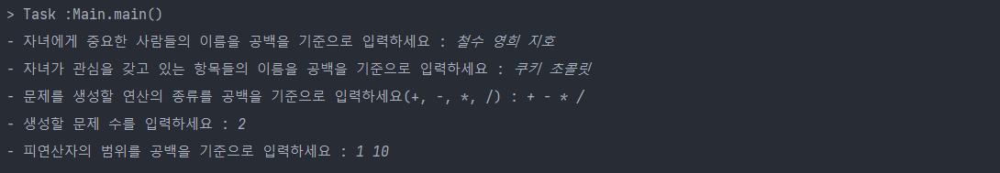
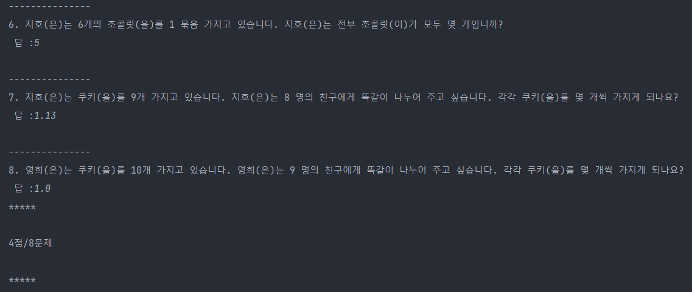
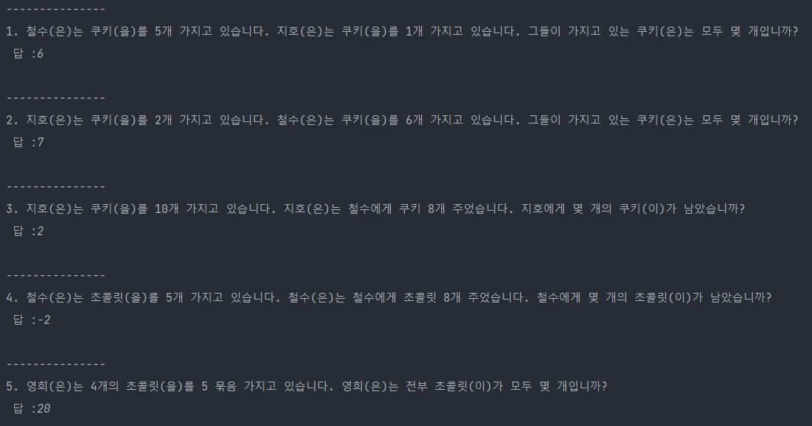

# WPG : Word Problem Generator

## 1. 요구사항 분석
1) 입력 요구 사항
   사용자가 자녀에게 중요한 사람의 이름, 관심 항목, 수학 문제의 종류(더하기, 빼기, 곱하기, 나누기), 문제 수, 피연산자의 범위를 입력할 수 있어야 한다.
2) 문제 생성
   입력된 데이터를 바탕으로 수학 문제를 생성한다. 문제는 랜덤하게 생성되며, 선택된 연산 유형에 따라 적절한 수와 범위의 숫자를 사용한다.
3) 문제 출력
   생성된 문제들을 출력하며, 출력 형식은 커맨드 라인 또는 다른 형태일 수 있다.
4) 문제 풀이 및 점수 부여
   학생이 연습 문제집을 풀고 답을 비교하여 점수를 부여한다. 단, 나눗셈 문제의 경우 소숫점 둘째 자리까지 반올림하는 것으로 하였다.

## 2. 클래스 다이어그램

## 3. 추후 변경 사항을 고려한 디자인 패턴 적용
1) 팩토리 메서드 패턴 (Factory Method Pattern)
   ProblemFactory 추상 클래스와 그것을 확장하는 AddProblemFactory, SubtractProblem-Factory, MultiplyProblemFactory, DivideProblemFactory 등을 통해 구현되었다. 이 패턴을 통해 문제 생성 로직을 캡슐화하고, 다양한 유형의 문제 생성 요구에 유연하게 대응할 수 있다.
- 다양한 템플릿 추가: 새로운 연산 유형이나 문제 템플릿을 추가할 때, 각 연산 유형에 대한 새로운 팩토리를 만들어 쉽게 통합할 수 있다. 예를 들어, 부등식 연산이나 분수, 돈을 다루는 새로운 문제 유형을 손쉽게 추가할 수 있다.
- 사진을 포함한 문제 생성: 사진 업로드 기능을 포함하는 새로운 템플릿 유형에 대해 새로운 팩토리를 개발하여 통합할 수 있다.
2) 빌더 패턴 (Builder Pattern)
   ProblemFactoryBuilder는 팩토리 객체의 생성 과정을 단순화하고, 복잡한 구성을 가진 팩토리 객체를 단계적으로 구축할 수 있게 한다. 이는 클라이언트가 복잡한 생성 과정을 몰라도 되게 하며, 다양한 구성을 쉽게 조합할 수 있도록 한다.
3) 싱글턴 패턴 (Singleton Pattern)
   시스템 전역에서 단 하나의 인스턴스만 유지되어야 하는 구성요소인 UserInterfaceHandler에 싱글턴 패턴을 적용하였다.
- GUI 추가: UserInterfaceHandler 클래스가 싱글턴으로 관리되므로, GUI 구성요소와 상호작용하는 중앙 관리 클래스로 활용될 수 있다. GUI 이벤트 처리 및 상태 관리를 위한 일관된 접근 방법을 제공한다.
4) 템플릿 메서드 패턴 (Template Method Pattern)
   AddProblem, SubtractProblem, MultiplyProblem, DivideProblem과 같은 구체적인 문제 유형들이 공통 인터페이스인 Problem을 구현하고 있다. 각 문제 클래스는 템플릿 메서드를 통해 특정 연산에 맞게 getQuestion()과 isCorrect() 메서드를 구현한다.
- 문제 처리 로직의 일관성 유지: 새로운 문제 유형이 추가되더라도, 기본적인 문제 처리 로직을 유지하면서 각 유형에 특화된 로직을 쉽게 추가할 수 있다.

## 4. 주요 클래스
1) 학생 관련 클래스
- Person, Item
  각 Person, Item 객체는 이름을 속성으로 가지며, 문제 문장 생성에 사용된다. 추후 사진을 포함하는 문제를 생성하기 위해서 클래스에 이미지 리소스를 관리할 수 있는 속성을 추가할 수 있다.
- InterestedThings
  이 클래스는 Person과 Item 객체의 리스트를 관리한다. 학생이 관심을 가지는 사람과 아이템을 저장하며, 이 데이터는 문제 생성에 사용된다.
- Student
  학생의 관심사, 문제 유형, 문제 수, 값 범위, 문제집, 점수를 속성으로 가진다. ProblemGen-erator를 사용하여 문제를 생성하고, 생성된 문제를 workBook에 저장한다. 학생의 점수를 관리하고, 문제집에서 전체 문제 수를 조회할 수 있다. 추후 Student 클래스 내에 성적 관리 로직을 추가하거나, 성적 데이터를 관리하는 별도의 클래스(예: ScoreManager)를 도입하여 학생별 성적을 효과적으로 관리할 수 있다.

2) 수학 문제 생성 관련 클래스
- ProblemFactory 및 구체적인 팩토리 클래스
  AddProblemFactory, SubtractProblemFactory, MultiplyProblemFactory, DivideProblem-Factory는 각각의 수학 연산을 생성하는 구체적인 팩토리 클래스이다. 각 팩토리는 입력으로 Person, Item, 그리고 연산에 필요한 피연산자들을 받는다. 이를 통해 Problem 인터페이스를 구현하는 적절한 문제 객체를 생성한다.
- Problem 인터페이스 및 구현체
  Problem 인터페이스는 문제를 표현하며, getQuestion()과 isCorrect(String answer) 메서드를 정의한다. AddProblem, SubtractProblem, MultiplyProblem, DivideProblem 클래스는 이 인터페이스를 구현하고, 문제에 대한 질문과 답을 생성한다.
- ProblemGenerator
  문제를 일괄적으로 생성하는 클래스로, 특정 연산 유형에 따라 필요한 문제 수만큼 ProblemFactory를 통해 문제를 생성하고 리스트로 반환한다.
- ProblemFactoryBuilder
  팩토리 메서드 패턴을 확장하여 다양한 문제 생성 팩토리를 구성하기 위해 사용되는 빌더 패턴을 적용한 클래스이다. 이 클래스는 문제 생성을 위한 다양한 파라미터들(사용될 사람들, 아이템, 연산 종류, 피연산자 값 등)을 설정하고, 설정된 값에 따라 적절한 문제 생성 팩토리 인스턴스를 생성한다.

3) 사용자 관련 클래스
- UserInterfaceHandler
  사용자와의 인터페이스를 관리하며 싱글턴 패턴으로 구현되어 있다. 주요 기능은 사용자로부터 다양한 입력을 받고, 그 입력을 기반으로 Student 클래스에 필요한 데이터를 제공한다.
- Main

5. 결과 캡처
   1, 3, 5, 7번은 정답, 2, 4, 6, 8은 오답이므로 4점/8문제이다.
